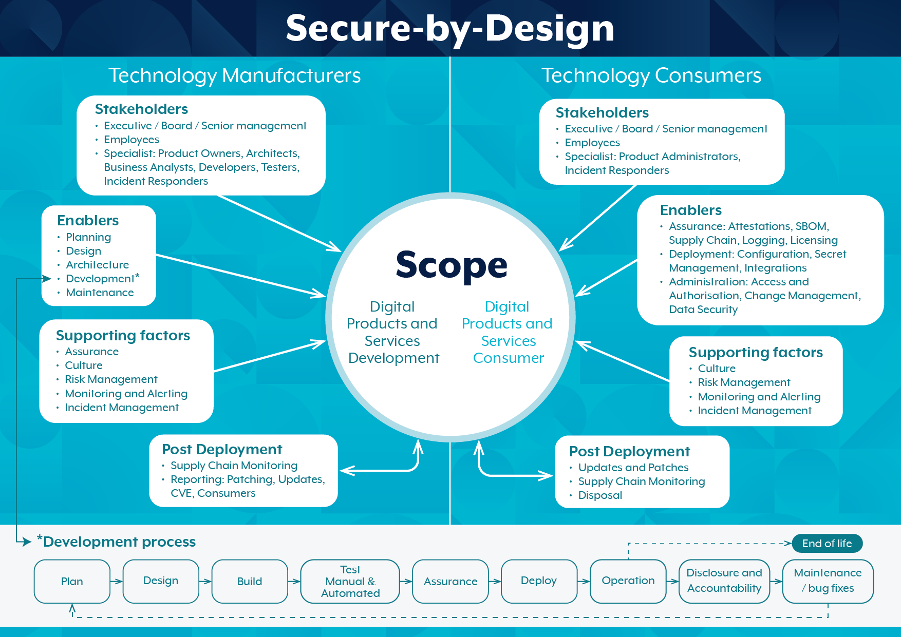

# Secure by Design

## Why adopt Secure by Design?

Products and services house critical data that, when compromised, can have severe economic, reputational and privacy impacts on individuals and organisations. Vulnerabilities – that could have easily been prevented – are increasingly resulting in everyday Australians being impacted by cybercrime and data breaches. Now more than ever, it is crucial for technology manufacturers and consumers to ensure the security of their products and services by adopting Secure by Design.

## What is Secure by Design?

Secure by Design is a proactive, security-focused approach to the design, development and deployment of products and services that necessitates a holistic organisational approach to cybersecurity. Secure by Design requires cyberthreats to be considered from the outset to enable mitigations through thoughtful design, architecture and security measures. Its core value is to protect consumer privacy and data through designing, developing and delivering products and services with fewer vulnerabilities, and then ensuring security is maintained throughout their life cycle.

## What can manufacturers and consumers expect?

Secure by Design emphasises the need for technology manufacturers to assume utmost responsibility for the security of their products and services, ensuring that security is the focal point of their entire life cycle and that they are released with as few vulnerabilities as possible. While consumers should be able to expect and demand products and services that are secure and free from vulnerabilities, they also have unique and important roles under the Secure by Design approach. Importantly, consumers must proactively educate themselves, understanding the risks associated with acquiring and operating products and services, and the mitigations needed to lessen their likelihood and impact.

## What is Secure by Default?

Secure by Default refers to products and services that are secure to use ‘out of the box’, with little to no additional setup or configuration required to achieve an adequate security baseline. Importantly, all built-in security measures, such as multi-factor authentication, auditing and event logging, are included in the base product at no additional cost to the consumer. Users are made acutely aware of the known risks that may be realised if any deviations from default configurations are made, as well as the increase in likelihood or impact of compromise unless additional mitigations are implemented.

## Feedback

Encouraging and enabling manufacturers and consumers to uplift their security via a Secure by Design approach is a core priority for Australian Signals Directorate (ASD)’s Australian Cyber Security Centre (ACSC). Secure by Design is an ongoing work stream empowered through engagement, the release of enabling tools and guidance, and the uplift of better-practice security standards across the Australian digital landscape.
If you would like to share your ideas or provide feedback, please email `acsc.sda@asd.gov.au`.

## Feature publications

- [What are Secure by Design foundations](https://www.cyber.gov.au/business-government/secure-design/secure-by-design/secure-by-design-foundations)
- [Shifting the Balance of Cybersecurity Risk](https://www.cyber.gov.au/business-government/secure-design/secure-by-design/shifting-balance-cybersecurity-risk)
- [Choosing secure and verifiable technologies: Executive guidance](https://www.cyber.gov.au/business-government/secure-design/secure-by-design/choosing-secure-and-verifiable-technologies-executive-guidance)
- [Choosing secure and verifiable technologies](https://www.cyber.gov.au/business-government/secure-design/secure-by-design/choosing-secure-and-verifiable-technologies)
- [Safe Software Deployment: How Software Manufacturers Can Ensure Reliability for Customers](https://www.cyber.gov.au/business-government/secure-design/secure-by-design/safe-software-deployment-how-software-manufacturers-can-ensure-reliability-customers)
- [The Case for Memory Safety Roadmaps: Why Both C-Suite Executives and Technical Experts Need to Take Memory Safe Coding Seriously](https://www.cyber.gov.au/business-government/secure-design/secure-by-design/case-memory-safe-roadmaps)
- [Exploring Memory Safety in Critical Open Source Projects](https://www.cyber.gov.au/business-government/secure-design/secure-by-design/exploring-memory-safety-in-critical-open-source-projects)
- [IoT Secure by Design guidance for manufacturers](https://www.cyber.gov.au/business-government/secure-design/secure-by-design/iot-secure-by-design-guidance-for-manufacturers)
- [Managing cryptographic keys and secrets](https://www.cyber.gov.au/business-government/secure-design/secure-by-design/managing-cryptographic-keys-secrets)
- Cross Domain Solutions
    - [Introduction to Cross Domain Solutions](https://www.cyber.gov.au/business-government/secure-design/secure-by-design/cross-domain-solutions/introduction-to-cross-domain-solutions)
    - [Fundamentals of Cross Domain Solutions](https://www.cyber.gov.au/business-government/secure-design/secure-by-design/cross-domain-solutions/fundamentals-of-cross-domain-solutions)
- [Modern defensible architecture](modern-defensible-architecture.md)